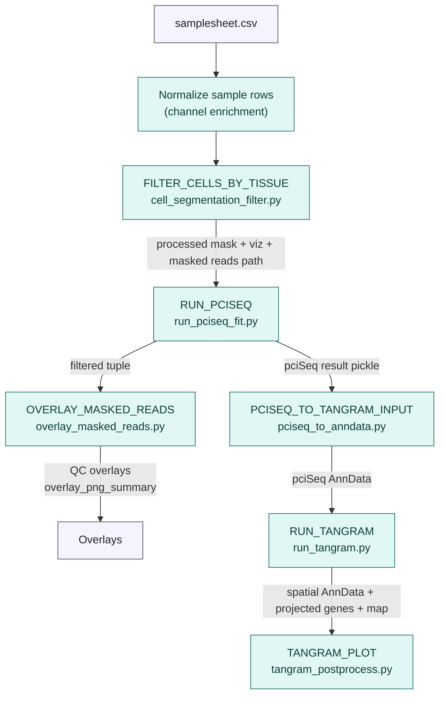

# Spatial Pipeline Flow (Beginner Friendly)

**Legend**

- **samplesheet.csv** – provides per-sample paths for masks, segmentations, and masked reads.
- **FILTER_CELLS_BY_TISSUE** – rebuilds/filters the segmentation mask.
- **RUN_PCISEQ** – overlays pciSeq classifications on the filtered mask.
- **OVERLAY_MASKED_READS** – generates QC figures with masked reads on the mask.
- **PCISEQ_TO_TANGRAM_INPUT** – converts pciSeq output into an AnnData compatible with Tangram.
- **RUN_TANGRAM** – aligns single-cell reference to spatial data, producing annotated AnnData plus projected genes and a mapping object.
- **TANGRAM_PLOT** – produces training-score plots, annotated scatter, and a cell-type count report.

Outputs are written under `outputs/nf/` in folders matching each major stage (e.g. `cell_filter`, `overlay_qc`, `pciseq`, `tangram`, `tangram/post`).
